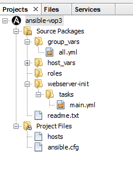

# Ansible Module for Netbeans

* WIP
* roughly based on:
  * [NetBeans Project Type Module Tutorial](https://platform.netbeans.org/tutorials/nbm-projecttype.html)
  * [NetBeans Project Type Extension Module Tutorial](https://platform.netbeans.org/tutorials/nbm-projectextension.html)
  * [NetBeans Code Completion Tutorial](https://platform.netbeans.org/tutorials/nbm-code-completion.html)
  * …
  * [Ansible Project - Best Practices](http://docs.ansible.com/ansible/playbooks_best_practices.html)
  * …
  
## current State

15.03.2020
- Syntax parser ansible ini files improvements

17.11.2019
- Added simple syntax parser to ansible ini files (hosts, ansible.cfg)

12.11.2019
- Fixed Ansible project type poison behavior affecting to other project types

15.09.2019
- Netbeans embedded CVS support added to project type
- Added project listing
- Added simple syntax coloring (ANTLR) to ansible ini files (hosts, ansible.cfg)

